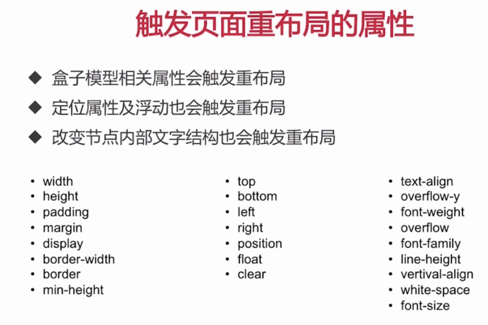
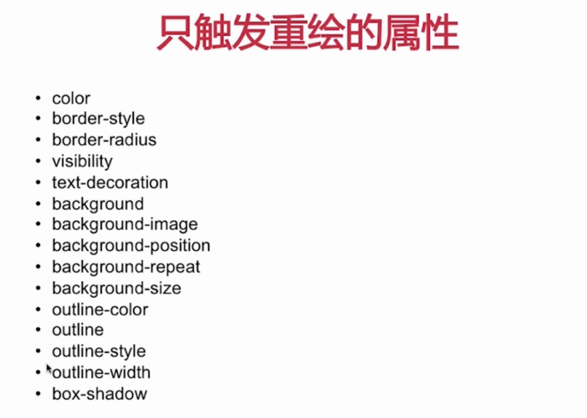
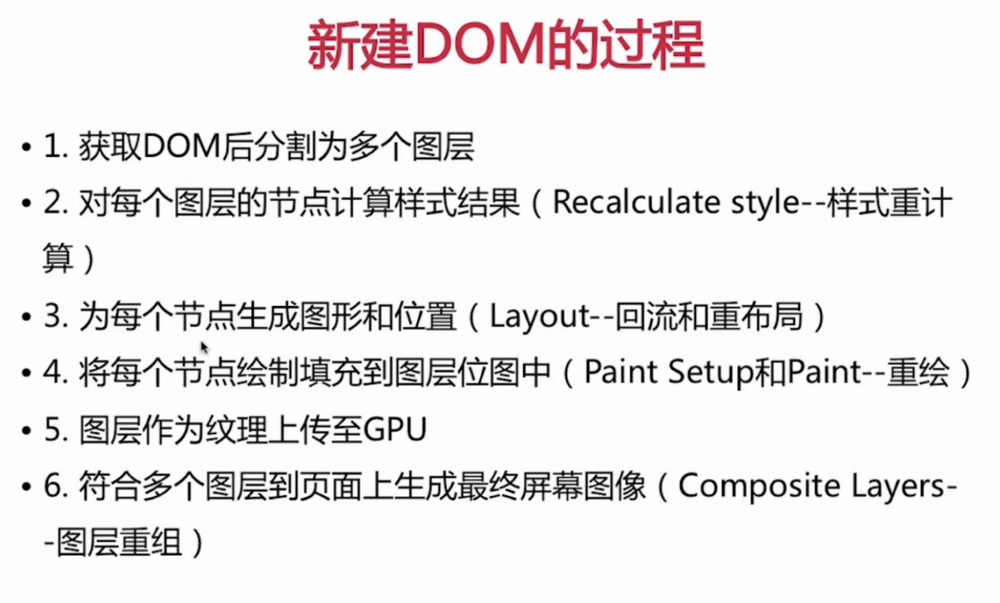

### CS 架构与 BS 架构

作为前端在看技术博客时，应该会经常看到“使网页像原生应用一样流畅”等类似的话语。原生应用和web网页的差别是什么呢？
原生应用是 CS 架构， 我们在使用原生应用的时候，需要先安装软件，安装的过程会把软件相应的资源解压到本地，用户在使用时候这些资源直接从本地获取。BS 架构， 用户打开网站， 该网站的相应资源需要从远端服务器获取（也可能从本地缓存获取）。从这一点来看， BS 架构在流畅度上来说， 很难做到与 CS 架构的软件相同的效果。

- 使请求的次数更少
- 使请求的资源更小
- 让页面尽可能快的展现在用户面前
- 体会用户的心理，给用户更好的体验

### 一、使请求的次数更少

#### 1. css、js、图片合并

**注意：合并文件可能会带来的问题**

- 首屏渲染问题

- 缓存失效问题

**解决方案：**

- 公共库合并

- 不同页面的资源合并

- 见机行事， 随机应变

#### 2. 使用 inline-img (base64编码)

- 适用于颜色少、简单的小图片

**注意：**
使用 base64 时，会时引用它的文件变大。一般 8k 的以下的使用 base64。因为这种情况下，引用文件增大的部分远小于增加一次 http 请求的网络传输的损耗。

#### 3. 使用字体图标

- 适用于颜色少、简单的小图片

#### 4. 合理的利用缓存

### 二、使请求的资源更小

#### 1. html、css、js 的压缩

- 无效代码删除（注释等）

- 空白字符压缩

- 代码混淆 （js）

#### 2. 选择合适的图片和图片的压缩

- png 图片

    - png8 -- 256 色 + 支持透明

    - png24 -- 2^24 色 + 不支持透明

    - png 32 -- 2^24 色 + 支持透明

- 不同格式图片常用的业务场景

    - jpg 有损压缩， 压缩率高， 不支持透明

    - png 支持透明

    - webp 压缩程度更好， 在 ios webview 有兼容问题

    - svg 矢量图、代码内嵌（base64）适用于相对较小，图片样式相对简单的场景

> 补充：
[webp 的使用](https://www.jianshu.com/p/101b047c1146)

### 三、让页面尽可能快的展现在用户面前

#### 1. 把 css 放在文档的头部

#### 2. 把 js 放在文档的尾部

##### html 渲染过程的一些特点

- 顺序执行，并发加载

    我们的资源可能会放在3到4个cdn上， 防止达到浏览器从同一个域名下载资源的上限，从而导致很多资源没有达到并发请求的效果。

    - 词法分析
    - 并发加载
    - 并发上限

- 是否阻塞

    1. css 的加载是否会阻塞之后的 js 的加载？
    2. css 的加载是否会阻塞后续 js 的执行？
    3. css 的加载是否会阻塞页面的渲染？
    4. js 的加载是否会阻塞后续 js 的执行和加载？

    - css 阻塞

    1. head 中的 css 阻塞页面的渲染；
    2. css 阻塞js的执行；
    3. css 不阻塞外部脚本的加载；预加载器。

    - js 阻塞

    1. 直接引入的 js 阻塞页面的渲染；
    2. js 不阻塞页资源的加载；（预先扫描器，预资源加载器发送请求去加载其他资源）
    3. js 顺序执行， 阻塞后续 js 逻辑的执行；

- 依赖关系

    1. html 依赖的样式文件应该放到文档顶部， 否则文档加载完了样式还没加载完， 容易造成页面闪动；

    2. js 脚本应该放在文档的底部， 否则加载完 js 文件，在执行过程中会阻塞页面的渲染；

- 引入方式

    1. css 是使用link方式引入还是使用@import的方式引入；
    2. js 通过sript标签， deffer 、 ansyc属性， 动态引用， 比如按路由引入；

#### 3. 懒加载与预加载

1. 懒加载

    1. 图片进入可视区后请求图片资源；
    2. 对于电商等图片很多，页面很长的业务场景适用；
    3. 减少无效资源的加载；
    4. 并发加载的资源过多会阻塞js的加载，影响网站的正常适用；

2. 预加载

    1. 图片等静态资源在使用之前的提前请求；
    2. 资源使用到时能从缓存中加载，提升用户体验；
    3. 页面展示的依赖关系维护；

- 预加载常见的使用方式

    1. 设置图片 display 为 none，在需要展示时就可以使用缓存了；
    2. 在js中new Img 并为 img 对象src赋值；
    3. 使用 XMLHttpRequest 对象；
    4. 使用 PreloadJS 库；

### 四、抓住用户心理，给用户更好的体验

### 五、补充

#### 1. css的性能会让js变慢？

一个线程 => js 解析
一个线程 => UI 渲染
这两个线程互斥， 不能同时执行。频繁触发重绘与回流，会导致UI频繁渲染，最终导致js变慢。css 的性能也很重要， 它不仅影响样式的渲染， 还会影响js的性能。

#### 2. 重绘和回流

**重绘：**

当render-tree中的一些元素需要更新属性，而这些属性只是影响元素的外观，风格，而不会影响布局的，比如background、color等。

**回流（重排）：**

当render-tree中的一部分或全部因为元素的规模尺寸，布局，隐藏等改变而需要重新构建。这就成为回流。当页面布局和几何属性改变时就需要回流。

**回流必定引起重绘，重绘不一定回流**

#### 3. 会引起回流或重绘的属性

#### 4. 新建DOM的过程

将频繁重绘回流的DOM元素单独作为一个独立图层，那么这个DOM元素的重绘和回流的影响只会在这个图层中。

##### 5. 如何将DOM元素变为一个新的图层？

chrome 中创建图层的条件

1. 3D或透视变换css属性（perspective transform）

2. 使用加速视频解码的vide节点

3. 拥有3D（WebGL）上下文或加速的2D上下文的canvas节点

4. 混合插件（如flash）

5. 对自己的opacity做css动画或使用一个动画webkit变换的元素

6. 拥有加速css过渡器的元素

7. 元素有一个包含复合层的后代节点（一个元素拥有一个子元素，该子元素在自己的层里）

8. 元素有一个z-index较低且包含一个复合层级的兄弟元素（换句话说就是该元素在复合层上面渲染）

##### 6. 如何避免回流或使回流或重绘是效率最高？

1. 避免使用触发重绘、回流的css属性；

2. 将重绘、回流的影响范围限制在单独的图层之内。将频繁重绘回流的DOM元素单独作为一个独立图层，那么这个DOM元素的重绘和回流的影响只会在这个图层中。

**注意层级**

图层并不是越多越好。因为页面渲染有一步是 composite layers (合并图层)。图层过多时会影响 composite layers 的效率。
