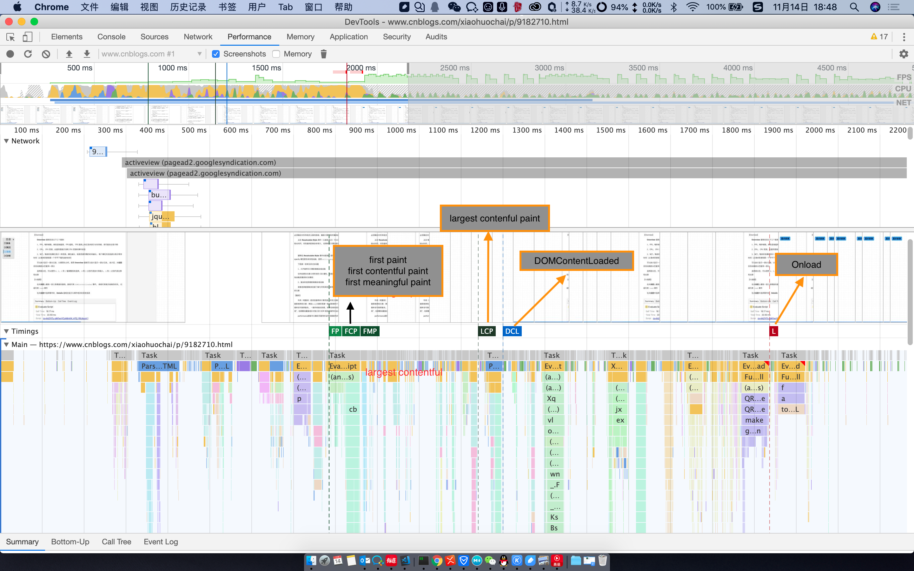

### 怎样检测网站的性能？

#### 一、从输入url到页面加载发生了什么？

总体来说分为以下几个过程
1. DNS 解析
2. TCP 连接
3. 发送 HTTP 请求
4. 服务器处理请求并返回 HTML 报文
5. 浏览器解析渲染页面
6. 连接结束

> 参考链接：
1. [从输入url到页面加载发生了什么？](https://segmentfault.com/a/1190000006879700)
2. [初探 performance – 监控网页与程序性能](http://www.alloyteam.com/2015/09/explore-performance/)

#### 如何监测以上各个阶段所消耗的时间？
> 要做性能优化就要搞清楚我们的网站展现在用户面前时各个阶段所消耗的时间，看看时间到底花在了哪里

#### 二、使用chrome浏览器控制台自带的 Performance 模块



1. 这张图表是根据 Profile*.json 文件生成的。start prpfiling and relod page 的过程中会生成一个名为 Profile-当前时间 的 json 文件。

2. 各个时间节点说明
    > 参考资料
    [前端感官性能的衡量和优化](https://baijiahao.baidu.com/s?id=1578324425528167531&wfr=spider&for=pc)
    1. FP (first paint)
    直译过来的意思就是浏览器第一次渲染(paint)，在First paint之前是白屏，在这个时间点之后用户就能看到（部分）页面内容。

    2. FCP (first contentful paint)
    代表文档中内容元素（文本、图像、Canvas，或者 SVG）首次渲染的时间。它通常情况下是无意义的渲染，比如头部和导航条。

    3. FMP (first meaningful paint)
    代表首次有意义的渲染时间（它的统计在重大的布局变化之后，往往代表了用户所关心的首次渲染时间），First Interactive Time、Consistently Interactive Time 分别表示首次可交互时间和持续可交互时间。

    4. LCP (largest contentful paint)


    5. DCL (DOMContentLoad)
    6. L (Load)


3. FPS
    FPS（frames per second）是用来分析动画的一个主要性能指标。让页面效果能够达到>=60fps(帧)/s的刷新频率以避免出现卡顿。能保持在60的FPS的话，那么用户体验就是不错的。

    * 为什么是60fps?

    我们的目标是保证页面要有高于每秒60fps(帧)的刷新频率，这和目前大多数显示器的刷新率相吻合(60Hz)。如果网页动画能够做到每秒60帧，就会跟显示器同步刷新，达到最佳的视觉效果。这意味着，一秒之内进行60次重新渲染，每次重新渲染的时间不能超过16.66毫秒。

4. 火焰图及summary图表中各个颜色说明
    1. 蓝色： 网络通信和 HTML 解析（Loading）
    2. 黄色： js 的执行 （Scripting）
    3. 紫色： 样式计算和布局， 即重排 （Rendering）
    4. 绿色： 重绘 （painting）
    5. 灰色： 其他事件花费的时间 （System）
    6. 白色： 空闲时间 (Idle)

5. Performance - timing 属性
    **从输入url到用户可以使用页面的全过程时间统计，会返回一个PerformanceTiming对象，单位均为毫秒**

    

    **按触发顺序排列所有属性**
    1. **navigationStart**:在同一个浏览器上下文中，前一个网页（与当前页面不一定同域）unload 的时间戳，如果无前一个网页 unload ，则与 fetchStart 值相等。

    2. **unloadEventStart**:前一个网页（与当前页面同域）unload 的时间戳，如果无前一个网页 unload 或者前一个网页与当前页面不同域，则值为 0。

    3. **unloadEventEnd**:和 unloadEventStart 相对应，返回前一个网页 unload 事件绑定的回调函数执行完毕的时间戳。

    4. **redirectStart**: 第一个 HTTP 重定向发生时的时间。有跳转且是同域名内的重定向才算，否则值为 0。

    5. **redirectEnd**: 最后一个 HTTP 重定向完成时的时间。有跳转且是同域名内的重定向才算，否则值为 0。

    6. **fetchStart**: 浏览器准备好使用 HTTP 请求抓取文档的时间，这发生在检查本地缓存之前。

    7. **domainLookupStart**: DNS 域名查询开始的时间，如果使用了本地缓存（即无 DNS 查询）或持久连接，则与 fetchStart 值相等。

    8. **domainLookupEnd**: DNS 域名查询完成的时间，如果使用了本地缓存（即无 DNS 查询）或持久连接，则与 fetchStart 值相等。

    9. **connectStart**: HTTP（TCP） 开始建立连接的时间，如果是持久连接，则与 fetchStart 值相等,如果在传输层发生了错误且重新建立连接，则这里显示的是新建立的连接开始的时间。

    10. **connectEnd** :HTTP（TCP） 完成建立连接的时间（完成握手），如果是持久连接，则与 fetchStart 值相等,如果在传输层发生了错误且重新建立连接，则这里显示的是新建立的连接完成的时间。

        **注意：这里握手结束，包括安全连接建立完成、SOCKS授权通过。**

    11. **secureConnectionStart**: HTTPS 连接开始的时间，如果不是安全连接，则值为 0。

    12. **requestStart**: HTTP 请求读取真实文档开始的时间（完成建立连接），包括从本地读取缓存,连接错误重连时，这里显示的也是新建立连接的时间。

    13. **responseStart**: HTTP 开始接收响应的时间（获取到第一个字节），包括从本地读取缓存。

    14. **responseEnd**: HTTP 响应全部接收完成的时间（获取到最后一个字节），包括从本地读取缓存。

    15. **domLoading**: 开始解析渲染 DOM 树的时间，此时 document.readyState 变为 loading，并将抛出 readystatechange 相关事件。

    16. **domInteractive**: 完成解析 DOM 树的时间，document.readyState 变为 interactive，并将抛出 readystatechange 相关事件。
    
        **注意：此时，只是 DOM 树解析完成， 这时候并没有开始加载网页内的资源。**

    17. **domContentLoadedEventStart** :DOM 解析完成后，网页内资源加载开始的时间,文档发生 DOMContentLoaded事件的时间。

    18. **domContentLoadedEventEnd**: DOM 解析完成后，网页内资源加载完成的时间（如 JS 脚本加载执行完毕），文档的DOMContentLoaded 事件的结束时间。

    19. **domComplete**: DOM 树解析完成，且资源也准备就绪的时间，document.readyState 变为 complete，并将抛出 readystatechange 相关事件。

    20. **loadEventStart**: load 事件发送给文档，也即 load 回调函数开始执行的时间,如果没有绑定 load 事件，值为 0。

    21. **loadEventEnd**: load 事件的回调函数执行完毕的时间,如果没有绑定 load 事件，值为 0。

    **常用的计算**
    - DNS查询耗时：domainLookupEnd - domainLookupStart
    - TCP连接接耗时 ：connectEnd - connectStart
    - request请求耗时 ：responseEnd - responseStart
    - 解析dom树耗时 ： domComplete - domInteractive
    - 白屏时间 ：responseStart - navigationStart
    - domready时间(用户可操作时间节点) ：domContentLoadedEventEnd - navigationStart
    - onload时间(总下载时间) ：loadEventEnd - navigationStart

6. Performance - navigation 属性
**旨在告诉开发者当前页面是通过什么方式导航过来的， 只有两个属性： type 和 redirectCount**

    **1. type：标志页面导航类型， 类型如下：**

    type 常数 | 枚举值 | 描述
    --- | --- | ---
    TYPE_NAVIGATE | 0 | 普通进入，包括：点击链接、在地址栏中输入 URL、表单提交、或者通过除下表中 TYPE_RELOAD 和 TYPE_BACK_FORWARD 的方式初始化脚本。
    TYPE_RELOAD | 1 | 通过刷新进入，包括：浏览器的刷新按钮、快捷键刷新、location.reload()等方法。
    TYPE_BACK_FORWARD | 2 | 通过操作历史记录进入，包括：浏览器的前进后退按钮、快捷键操作、history.forward()、history.back()、history.go(num)。
    TYPE_UNDEFINED | 255 | 其他非以上类型的方式进入。

    **注意： history.go(url)这种非标准写法目前主流浏览器均不支持，问题可参考：[history-issue](http://stackoverflow.com/questions/6277283/history-gourl-issue)**

    **2. redirectCount:表示到达最终页面前，重定向的次数，但是这个接口有同源策略限制，即仅能检测同源的重定向。**

    **注意：所有前端模拟的重定向都无法统计到，因为不属于HTTP重定向**

7. Performance - memory 属性（非标准属性）
    > 描述内存多少，是在Chrome中添加的一个非标准属性。

    1. **jsHeapSizeLimit**: 内存大小限制
    2. **totalJSHeapSize**: 可使用的内存
    3. **usedJSHeapSize**: JS对象(包括V8引擎内部对象)占用的内存，不能大于totalJSHeapSize，如果大于，有可能出现了内存泄漏

8. Performance - timeOrigin 属性（非标准属性）
    > 返回一个表示 the performance measurement 开始时间的高精度 timestamp

9. Performance.onresourcetimingbufferfull 事件处理程序
    > onresourcetimingbufferfull 属性是一个在resourcetimingbufferfull事件触发时会被调用的 event handler 。这个事件当浏览器的资源时间性能缓冲区已满时会触发。

    ```
    function buffer_full(event) {
        console.log("WARNING: Resource Timing Buffer is FULL!");
        performance.setResourceTimingBufferSize(200);
    }

    function init() {
        // Set a callback if the resource buffer becomes filled
        performance.onresourcetimingbufferfull = buffer_full;
    }

    <body onload="init()">
    ```

10. Performance 的方法

    **1. getEntries()**

    获取所有资源请求的时间数据,这个函数返回一个按startTime排序的对象数组，数组成员除了会自动根据所请求资源的变化而改变以外，还可以用mark(),measure()方法自定义添加，该对象的属性中除了包含资源加载时间还有以下五个属性:
        1. name：资源名称，是资源的绝对路径或调用mark方法自定义的名称
        2. startTime:开始时间
        3. duration：加载时间
        4. entryType：资源类型，entryType类型不同数组中的对象结构也不同！具体见下
        5. initiatorType：谁发起的请求，具体见下

    **entryType的值**

    值 | 该类型对象 | 描述
    -- | -- | --
    mark | PerformanceMark | 通过mark()方法添加到数组中的对象
    measure | PerformanceMeasure | 通过measure()方法添加到数组中的对象
    paint | PerformancePaintTiming | 值为first-paint'首次绘制、'first-contentful-paint'首次内容绘制。
    resource | PerformanceResourceTiming | 资源加载时间，用处最多
    navigation | PerformanceNavigationTiming | 现除chrome和Opera外均不支持，导航相关信息
    frame | PerformanceFrameTiming | 现浏览器均未支持

    **initiatorType的值**

    发起对象 | 值 | 描述
    -- | -- | --
    a Element | link/script/img/iframe等 | 通过标签形式加载的资源，值是该节点名的小写形式
    a CSS resourc | css | 通过css样式加载的资源，比如background的url方式加载资源
    a XMLHttpRequest object | xmlhttprequest/fetch | 通过xhr加载的资源
    a PerformanceNavigationTiming object | navigation | 当对象是PerformanceNavigationTiming时返回

        注意：
        1. 目前通过<audio>，<video>加载资源,initiatorType还无法返回"audio"和"video"，chrome中只能返回空字符串,firfox返回"other"
        2. 如果一个图片在页面内既用img引入，又作为背景图片引入，那么initiatorType返回的"img"
        3. performance.getEntries(params)这种形式仍出于草案阶段，目前仍有很多浏览器未支持。但是非常有用，期待早些实现。
        4. 使用该方法统计资源信息的时候首先可以合理利用clearResourceTimings清除已统计过的对象避免重复统计，其次要过滤掉因上报统计数据而产生的对象。

    **2. getEntriesByName(name, type[optional])**

    **3. getEntriesByType(type)**

    **4. clearResourceTimings()**

    **5. mark(name), clearMarks()**
    **6. measure(name, startMark, endMark),clearMeasures()**

    **7. now()**
        performance.now()是当前时间与performance.timing.navigationStart的时间差，以微秒（百万分之一秒）为单位的时间，与 Date.now()-performance.timing.navigationStart的区别是不受系统程序执行阻塞的影响，因此更加精准。

#### 三、使用LightHouse 、 Yslow等工具检测

**1.在谷歌应用商店上搜索工具， 并安装（需要科学上网）**


