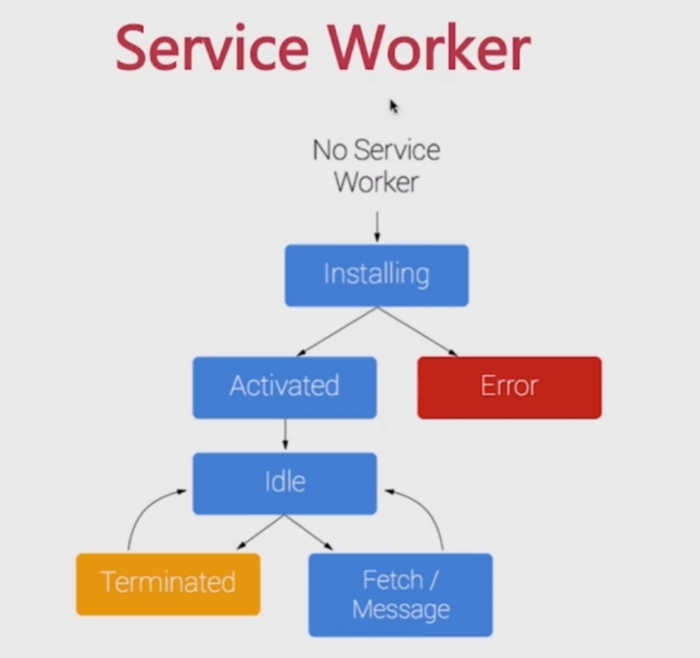
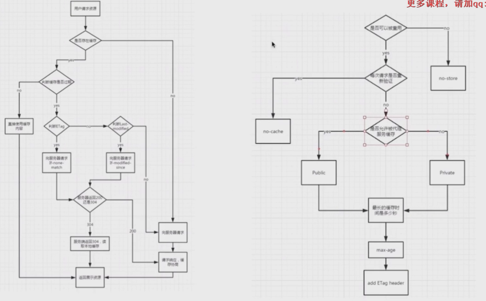
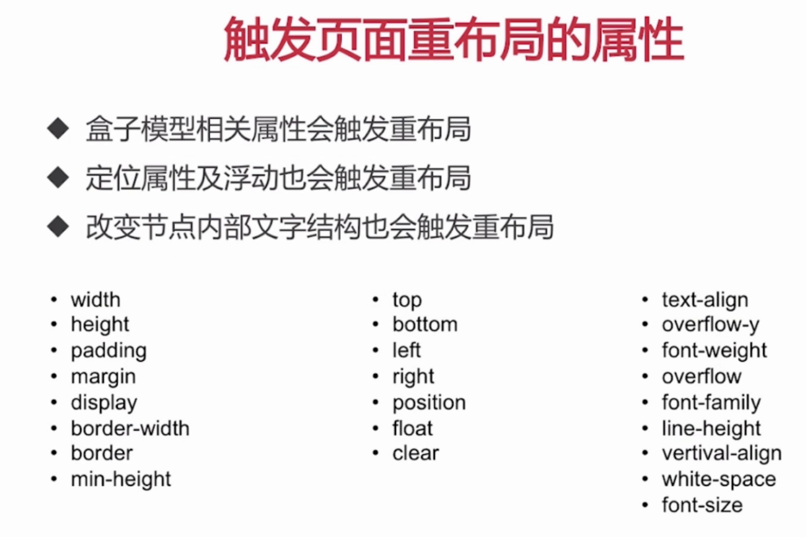
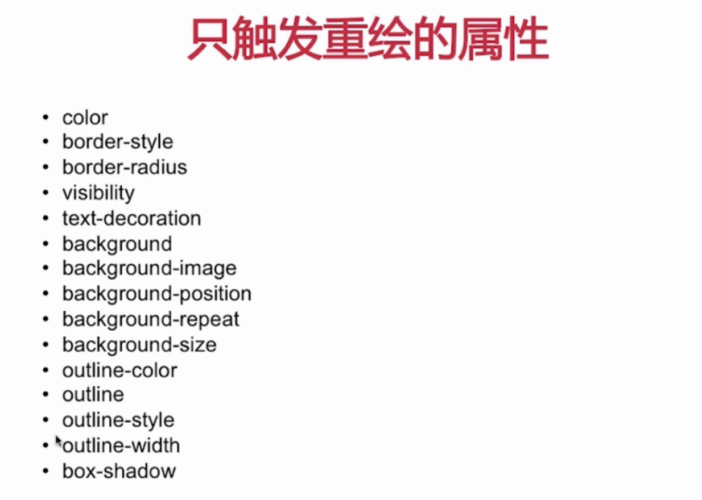

### CS 架构与 BS 架构

作为前端在看技术博客时，应该会经常看到“使网页像原生应用一样流畅”等类似的话语。原生应用和web网页的差别是什么呢？
原生应用是 CS 架构， 我们在使用原生应用的时候，需要先安装软件，安装的过程会把软件相应的资源解压到本地，用户在使用时候这些资源直接从本地获取。BS 架构， 用户打开网站， 该网站的相应资源需要从远端服务器获取（也可能从本地缓存获取）。从这一点来看， BS 架构在流畅度上来说， 很难做到与 CS 架构的软件相同的效果。

- 使请求的次数更少
- 使请求的资源更小
- 让页面尽可能快的展现在用户面前
- 体会用户的心理，给用户更好的体验

### 一、使请求的次数更少

#### 1. css、js、图片合并

**注意：合并文件可能会带来的问题**

- 首屏渲染问题

- 缓存失效问题

**解决方案：**

- 公共库合并

- 不同页面的资源合并

- 见机行事， 随机应变

#### 2. 使用 inline-img (base64编码)

- 适用于颜色少、简单的小图片

**注意：**
使用 base64 时，会时引用它的文件变大。一般 8k 的以下的使用 base64。因为这种情况下，引用文件增大的部分远小于增加一次 http 请求的网络传输的损耗。

#### 3. 使用字体图标

- 适用于颜色少、简单的小图片

#### 4. 合理的利用缓存

##### 4-1 浏览器存储

1. cookie

    cookie 是由服务端生成，存储在客户端；http是无状态的。cookie 的设计初衷是用于客户端和服务端通信。

- cookie 存储的限制

    1. 作为浏览器存储， 大小 4KB 左右；

    2. 需要设置过期时间；

    3. httponly 不支持 js 读写 cookie， 防止被攻击；

    3. cookie 中在相关域名下面 —— cdn 的流量损耗；（在该域名下每次请求都会携带 cookie 信息， 然而并不是每个请求都会需要 cookie. 解决方法是：cdn 域名和主站域名要分开）

2. localStorage

    1. html5 设计出来专门用于浏览器存储的；
    2. 大小为5M左右；
    3. 仅在客户端使用，不和服务端进行通信；
    4. 浏览器本地缓存方案；

3. sessionStorage

    1. 回话级别的浏览器存储（浏览器标签关闭，数据销毁）；
    2. 大小为 5 M左右；
    3. 仅在客户端使用，不和服务端进行通信；
    4. 对于表单信息的维护；

4. indexDB

    1. indexDB 是一种低级API，用于客户端存储大量结构化数据。该API使用索引来实现对该数据的高性能搜索。虽然web storage 对于存储较少的数据很有用， 但对于存储量更大的结构化数据来说，这种方法不太有用。indexDB 提供了一个解决方案；

    2. 为应用创建离线版本；

5. service workers 产生的意义

    1. js 执行和 ui 渲染会互相阻塞。可以把复杂的js运算放在一个service worker 里执行， 这样就会减轻js主线程的压力。使得主线程执行时间缩短，从而更早的进行ui渲染。

    2. service worker 是一个脚本，浏览器独立于当前网页，将其在后台运行，为实现一些不依赖页面或者用户交互的特性打开了一扇大门。在未来这些特性将包括推送消息，背景后台同步， geofencing （地理围栏定位）， 但它将推出的第一个首要特性，就是拦截和处理网络请求的能力，包括以编程方式来管理被缓存的响应。

    **主要应用场景**

    1. 使用拦截和处理网络请求的能力，去实现一个离线应用；
    2. 使用Service Worker 在后台运行同时能和页面通信的能力，去实现大规模后台数据处理。

    **Service Worker 生命周期**
    
    

    **Service Worker 的调试**
    在chrome浏览器地址栏输入一下指令：
    1. chrome://serviceworker-internals/ （）
    2. chrome://inspect/#service-workers（检测当前浏览器正在运行的service worker）

6. PWA

    PWA （Progressive Web Apps）是一种Web App 新模型，并不是具体指某一种前沿的技术或者某一个单一的知识点，这是一个渐进式的 Web App ，是通过一系列的 Web 特性，配合优秀的 UI 交互设计，逐步的增强 Web App 的用户体验。

    1. 可靠：在没有网络的环境中也能提供基本的页面访问，而不会出现“未连接到互联网”的页面；
    2. 快速：针对网页渲染及网络数据访问有较好优化；
    3. 融入：应用可以被增加到手机桌面，并且和普通应用一样有全屏、推送等特性。

##### 4-2 缓存

http header 控制缓存策略，这些缓存策略都是由服务端配置的。

- Cache-Control 

1. max-age 指定缓存的最大有效时间，优先级高于 expires 。可以让浏览器不询问服务器，直接使用缓存。（http1.1）
2. s-maxage 意思同 max-age，指定缓存的最大有效时间。优先级高于 max-age，只对public 缓存生效。 在有效期内，可从cdn等 public 缓存处获取资源。超出有效期则从源服务器获取（cdn 的回源）。
3. private 比如我们自己的浏览器缓存就属于 private 缓存，只有使用本机的浏览器才能使用这些缓存。
4. public 比如cdn缓存就属于 public 缓存。
5. no-cache 通常搭配 max-age = 0 使用， 它表示每次都要去服务器端询问是否可以使用缓存（协商缓存）。
6. no-store 不存， 没有缓存。配了该属性的请求资源，不会缓存，每次都需要从服务器获取。
7. expires 缓存过期时间，用来指定资源到期的时间，是服务器端的具体时间点。告诉浏览器在过期时间前浏览器可以直接从浏览器的缓存中读取数据，而无需再次请求。由于是服务端时间，如果本地和服务器时间相差较大则误差较大。（http1.0 强制缓存，无需问服务器）
8. last-modified/If-modified-sice 基于客户端和服务端协商的缓存机制。last-modified（responese header），if-modified-since（request header）。需要与 cache-control 共同使用。如果配置 max-age，在max-age没有过期之前会直接使用缓存（强制缓存优先级高于协商缓存）。

9. ETag/If-none-match, ETag（response 中返回ETag）,If-none-match(请求中携带)。比 last-modified 更加精确。比如毫秒级别的修改，last-modified 是分辨不出来的。

- last-modified 的缺点

1. 某些服务端不能精确的获取修改时间；
2. 文件修改时间改了， 但文件内容却没有变。导致应该使用缓存却没有使用缓存。

- 强制缓存

cache-control 
expires

- 协商缓存

last-modified 
etag

分级缓存策略

缓存流程

### 二、使请求的资源更小

#### 1. html、css、js 的压缩

- 无效代码删除（注释等）

- 空白字符压缩

- 代码混淆 （js）

#### 2. 选择合适的图片和图片的压缩

- png 图片

    - png8 -- 256 色 + 支持透明

    - png24 -- 2^24 色 + 不支持透明

    - png 32 -- 2^24 色 + 支持透明

- 不同格式图片常用的业务场景

    - jpg 有损压缩， 压缩率高， 不支持透明

    - png 支持透明

    - webp 压缩程度更好， 在 ios webview 有兼容问题

    - svg 矢量图、代码内嵌（base64）适用于相对较小，图片样式相对简单的场景

> 补充：
[webp 的使用](https://www.jianshu.com/p/101b047c1146)

### 三、让页面尽可能快的展现在用户面前

#### 1. 把 css 放在文档的头部

#### 2. 把 js 放在文档的尾部

##### html 渲染过程的一些特点

- 顺序执行，并发加载

    我们的资源可能会放在3到4个cdn上， 防止达到浏览器从同一个域名下载资源的上限，从而导致很多资源没有达到并发请求的效果。

    - 词法分析
    - 并发加载
    - 并发上限

- 是否阻塞

    1. css 的加载是否会阻塞之后的 js 的加载？
    2. css 的加载是否会阻塞后续 js 的执行？
    3. css 的加载是否会阻塞页面的渲染？
    4. js 的加载是否会阻塞后续 js 的执行和加载？

    - css 阻塞

    1. head 中的 css 阻塞页面的渲染；
    2. css 阻塞js的执行；
    3. css 不阻塞外部脚本的加载；预加载器。

    - js 阻塞

    1. 直接引入的 js 阻塞页面的渲染；
    2. js 不阻塞页资源的加载；（预先扫描器，预资源加载器发送请求去加载其他资源）
    3. js 顺序执行， 阻塞后续 js 逻辑的执行；

- 依赖关系

    1. html 依赖的样式文件应该放到文档顶部， 否则文档加载完了样式还没加载完， 容易造成页面闪动；

    2. js 脚本应该放在文档的底部， 否则加载完 js 文件，在执行过程中会阻塞页面的渲染；

- 引入方式

    1. css 是使用link方式引入还是使用@import的方式引入；
    2. js 通过sript标签， deffer 、 ansyc属性， 动态引用， 比如按路由引入；

#### 3. 懒加载与预加载

1. 懒加载

    1. 图片进入可视区后请求图片资源；
    2. 对于电商等图片很多，页面很长的业务场景适用；
    3. 减少无效资源的加载；
    4. 并发加载的资源过多会阻塞js的加载，影响网站的正常适用；

2. 预加载

    1. 图片等静态资源在使用之前的提前请求；
    2. 资源使用到时能从缓存中加载，提升用户体验；
    3. 页面展示的依赖关系维护；

- 预加载常见的使用方式

    1. 设置图片 display 为 none，在需要展示时就可以使用缓存了；
    2. 在js中new Img 并为 img 对象src赋值；
    3. 使用 XMLHttpRequest 对象；
    4. 使用 PreloadJS 库；

### 四、抓住用户心理，给用户更好的体验

### 五、补充

#### 1. css的性能会让js变慢？

一个线程 => js 解析
一个线程 => UI 渲染
这两个线程互斥， 不能同时执行。频繁触发重绘与回流，会导致UI频繁渲染，最终导致js变慢。css 的性能也很重要， 它不仅影响样式的渲染， 还会影响js的性能。

#### 2. 重绘和回流

**重绘：**

当render-tree中的一些元素需要更新属性，而这些属性只是影响元素的外观，风格，而不会影响布局的，比如background、color等。

**回流（重排）：**

当render-tree中的一部分或全部因为元素的规模尺寸，布局，隐藏等改变而需要重新构建。这就成为回流。当页面布局和几何属性改变时就需要回流。

**回流必定引起重绘，重绘不一定回流**

#### 3. 会引起回流或重绘的属性

#### 4. 新建DOM的过程

将频繁重绘回流的DOM元素单独作为一个独立图层，那么这个DOM元素的重绘和回流的影响只会在这个图层中。

##### 5. 如何将DOM元素变为一个新的图层？

chrome 中创建图层的条件

1. 3D或透视变换css属性（perspective transform）

2. 使用加速视频解码的vide节点

3. 拥有3D（WebGL）上下文或加速的2D上下文的canvas节点

4. 混合插件（如flash）

5. 对自己的opacity做css动画或使用一个动画webkit变换的元素

6. 拥有加速css过渡器的元素

7. 元素有一个包含复合层的后代节点（一个元素拥有一个子元素，该子元素在自己的层里）

8. 元素有一个z-index较低且包含一个复合层级的兄弟元素（换句话说就是该元素在复合层上面渲染）

##### 6. 如何避免回流或使回流或重绘是效率最高？

1. 避免使用触发重绘、回流的css属性；

2. 将重绘、回流的影响范围限制在单独的图层之内。将频繁重绘回流的DOM元素单独作为一个独立图层，那么这个DOM元素的重绘和回流的影响只会在这个图层中。

**注意层级**

图层并不是越多越好。因为页面渲染有一步是 composite layers (合并图层)。图层过多时会影响 composite layers 的效率。
